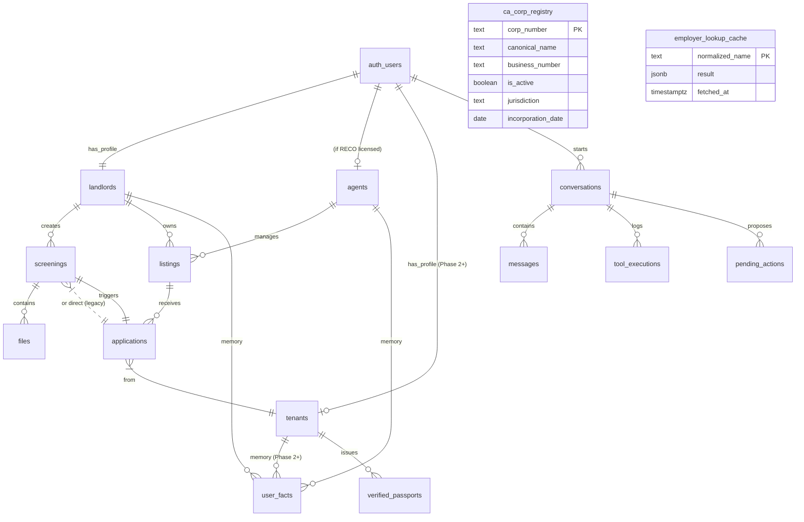

# Stayloop 数据模型

> Supabase Postgres，所有用户数据表启用 RLS。
> 此文档应与 migrations 同步更新。最新 schema 以 Supabase 为准。

## ERD（核心实体关系）



## 现有表（已上线）

### `auth.users`（Supabase 内置）
认证主体。每个 user 对应 landlords / agents / tenants 中的一行 profile。

### `landlords`
房东 profile。
```sql
id              uuid PK
auth_id         uuid FK → auth.users.id
email           text
plan            text  -- 'free' | 'pro' | 'enterprise'
stripe_customer_id  text
created_at      timestamptz
```
RLS：用户只能读 / 写 `auth_id = auth.uid()` 的行。

### `screenings`
单次筛查记录。包含上传的文件 + AI 评分结果 + forensics + 法庭记录。
```sql
id                       uuid PK
landlord_id              uuid FK → landlords.id
tenant_name              text
ai_extracted_name        text
monthly_income           numeric
monthly_rent             numeric
status                   text  -- 'uploading' | 'scoring' | 'scored' | 'error'
ai_score                 int
ai_summary               text
ai_dimension_notes       jsonb  -- v3 scores + details + extracted fields
forensics_detail         jsonb  -- 完整 ForensicsReport
forensics_penalty        int
forensics_zeroed_dims    text[]
court_records_detail     jsonb  -- CanLII + Portal 结果
deep_check_result        jsonb  -- arm-length 结果
files                    jsonb  -- [{path, name, size, mime, kind}]
hard_gates_triggered     text[]
red_flags                text[]
red_flag_penalty         int
created_at               timestamptz
scored_at                timestamptz
```
RLS：landlord 只能看自己的。

### `ca_corp_registry`
联邦公司注册（来自 Corporations Canada open data，月度刷新）。
```sql
id                  bigserial PK
corp_number         text
jurisdiction        text  -- 'ca_federal'
canonical_name      text  -- 去除法律后缀的小写形式
display_name        text
alt_names           text[]
status              text  -- '1' active, '9' liquidating, '11' dissolved
is_active           boolean
entity_type         text
incorporation_date  date
business_number     text  -- CRA BN
address_*           text  -- line1, line2, city, province, postal_code
last_seen_at        timestamptz
UNIQUE (jurisdiction, corp_number)
```
RLS：service-role only（不直接面向用户）。
索引：trigram on canonical_name + alt_names（pg_trgm GIN）。
RPC：
- `search_corp_registry(q, min_sim)` — 模糊搜索
- `lookup_corp_by_bn(bn)` — BN 反查

### `employer_lookup_cache`
（Phase 3 历史遗留）OpenCorporates 查询缓存。Phase 5 后转为 fallback。
```sql
normalized_name  text PK
display_name     text
result           jsonb  -- CompanyRegistryInfo | null
fetched_at       timestamptz
```

## 待新增表（Sprint 1-2）

### `conversations`
每个 user-agent 长会话一条记录。
```sql
id              uuid PK
user_id         uuid    -- auth.users.id
user_kind       text    -- 'landlord' | 'agent' | 'tenant'
agent_kind      text    -- 'logic' | 'nova' | 'echo' | 'analyst' | 'mediator'
context         jsonb   -- 该 agent 在这个会话累积的上下文
started_at      timestamptz
last_message_at timestamptz
```
RLS：user_id = auth.uid()。

### `messages`
单条会话消息。包含 user / assistant / tool_result 三种角色。
```sql
id              uuid PK
conversation_id uuid FK → conversations.id
role            text   -- 'user' | 'assistant' | 'tool'
content         jsonb  -- 结构化 blocks: [{kind, ...}]
tool_calls      jsonb  -- 如果 assistant 调用了工具，记录调用
created_at      timestamptz
```

### `user_facts`
长期记忆。AI 在会话末尾抽取关键 facts 入库，下次召回。
```sql
id                bigserial PK
user_id           uuid
fact              text     -- "Jason 特别关注雇佣信伪造"
fact_type         text     -- 'preference' | 'past_concern' | 'screening_pattern' | 'business_context'
confidence        real
source_message_id uuid
created_at        timestamptz
superseded_at     timestamptz  -- 被新 fact 推翻时设置
```

### `tool_executions`
**审计 trail 主表**。每次工具调用都记录。
```sql
id              uuid PK
conversation_id uuid     -- 哪个会话发起的
message_id      uuid     -- 哪条 assistant message 触发的
tool_name       text     -- 'run_pdf_forensics' 等
tool_version    text     -- '1.0.0'
input           jsonb
output          jsonb
status          text     -- 'success' | 'error' | 'timeout'
error_message   text
duration_ms     int
created_at      timestamptz
```
**用途**：
- AI critical claim 必须 cite 一个 execution id
- PIPEDA / Ontario Human Rights 合规审计
- 调试 agent 决策路径
- 将来开放 Trust API 时直接变成计费 / 限流数据源

### `pending_actions`
AI 提议的、需要用户批准的操作。
```sql
id              uuid PK
conversation_id uuid
action_kind     text     -- 'send_email' | 'reject_applicant' | 'post_listing' 等
payload         jsonb    -- 操作具体内容（邮件草稿等）
status          text     -- 'pending' | 'approved' | 'rejected' | 'modified' | 'expired'
proposed_at     timestamptz
decided_at      timestamptz
decided_by      uuid     -- 通常 = conversation.user_id
final_payload   jsonb    -- 用户修改后的最终内容
```

## Phase 2+ 新增表

### `agents`
RECO 持牌经纪 profile。
```sql
id                uuid PK
auth_id           uuid FK
brokerage         text
reco_licence_no   text
plan              text  -- 'solo' | 'brokerage' | 'enterprise'
created_at        timestamptz
```

### `listings`
房源记录。
```sql
id                  uuid PK
landlord_id         uuid FK NULLABLE
agent_id            uuid FK NULLABLE
-- 必须至少有一个非空
title               text
description_en      text
description_zh      text
address             text
city                text
province            text
postal_code         text
monthly_rent        numeric
bedrooms            int
bathrooms           numeric
parking             text
utilities_included  text[]
pet_policy          text
available_date      date
mls_number          text NULLABLE
source              text  -- 'manual' | 'mls_pdf' | 'realtor_url' | 'kijiji_url'
status              text  -- 'draft' | 'active' | 'leased' | 'archived'
photos              jsonb  -- [{url, alt}]
created_at          timestamptz
```

### `applications`
租客对房源的申请。
```sql
id                uuid PK
listing_id        uuid FK
tenant_id         uuid FK NULLABLE  -- Phase 2+ 注册租客
applicant_data    jsonb              -- 名字 / 联系方式 / Verified Passport hash
screening_id      uuid FK NULLABLE
status            text  -- 'submitted' | 'screening' | 'approved' | 'rejected' | 'withdrawn'
submitted_at      timestamptz
decided_at        timestamptz
```

### `tenants`
租客 profile（Phase 2+）。
```sql
id              uuid PK
auth_id         uuid FK
email           text
phone           text
plan            text  -- 'free' | 'verified'
created_at      timestamptz
```

### `verified_passports`
Verified Renter Passport 凭证。
```sql
id                  uuid PK
tenant_id           uuid FK
hash                text UNIQUE  -- 公开可验证
verification_data   jsonb  -- 各项验证内容 + 关联 tool_executions
score_band          text   -- 'top_8' | 'top_30' | 'median'
issued_at           timestamptz
expires_at          timestamptz  -- issued + 90 days
revoked_at          timestamptz
```

## RLS 策略总则

| 表 | 谁可以读 | 谁可以写 |
|---|---|---|
| `landlords / agents / tenants` | 自己的行 | 自己的行 |
| `screenings` | 创建者 landlord | 创建者 landlord |
| `listings` | 创建者 + 公开（Phase 2+ 列表页）| 创建者 |
| `applications` | tenant + listing 所属 landlord/agent | tenant 创建、双方各自更新 status |
| `conversations` / `messages` / `user_facts` | 对应 user | 对应 user（assistant role 由 service 写入） |
| `tool_executions` / `pending_actions` | 对应 user（看自己的会话） | service-role 写入，user 决策 pending_actions |
| `verified_passports` | tenant 自己 + 持有 hash 的人验证 | tenant 创建，service-role 签发 |
| `ca_corp_registry` / `employer_lookup_cache` | service-role only | service-role only |

## 命名约定

- 表名复数（`screenings`, `listings`）
- 主键 `id`（UUID 或 bigserial）
- 时间戳 `*_at`（ISO 8601）
- 状态枚举 `status` 或 `*_kind`
- 外键 `*_id`
- JSONB 字段名后缀 `_detail` 或 `_data`

## 迁移政策

- 每次迁移用 `mcp__supabase__apply_migration` 命名（如 `ca_corp_registry_v1`）
- 不删除列（rename 用 view）
- 加列必须 nullable 或有 default
- 删数据前先 archive 到 `_archive` 表
