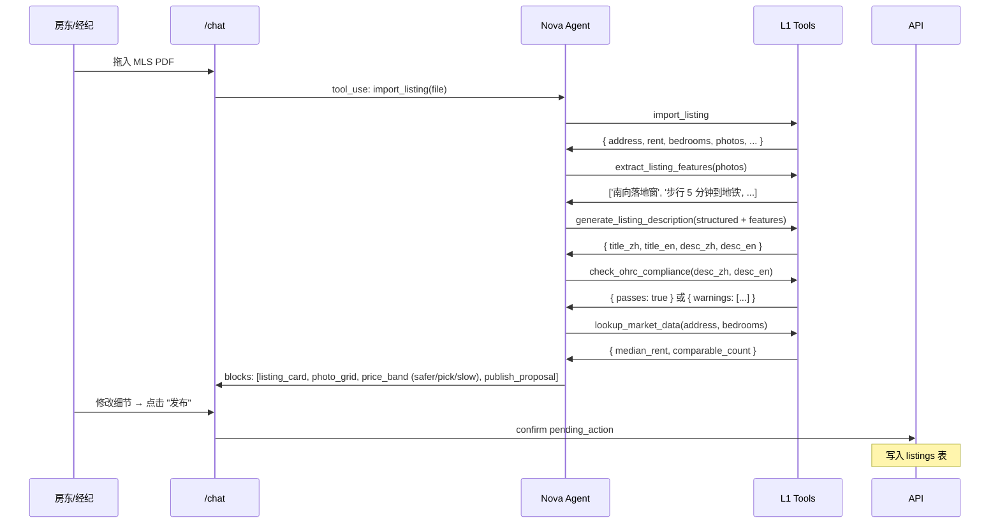

# Flow: Listing Import（房东 / 经纪）

> Nova agent 主导（Sprint 4-5 上线）。从多个外部源把房源数据带进 stayloop。

## 三种导入路径

### 路径 1：粘贴文字（最简单）
- 用户粘贴一段房源描述（Kijiji / 51.ca / 蝌蚪 / 自己写的）
- Nova 调用 `import_listing` 工具 + Sonnet 解析
- 提取结构化字段 + 询问缺失项

### 路径 2：URL 抓取
- 用户粘贴 Realtor.ca / Kijiji / 51.ca / 蝌蚪 URL
- Cloudflare Worker fetch HTML → AI extract structured data
- **限制**：只导入用户**自己挂的**房源（防 TOS 违规）

### 路径 3：MLS 导出（经纪专用）
- 经纪从 Stratus / Matrix / Realm 后台导出 PDF / CSV
- 上传到 stayloop → Nova 解析 + 提取图片
- **完全合规**：经纪有权 export 自己 listing 给第三方工具

### 路径 4（未来）：MLS RESO Web API
- 经纪 OAuth 授权 → 自动同步
- 推迟到 5-10 经纪稳定使用后再做

## Sequence

## Sprint 4-5 待详细设计

- `import_listing` 工具的 PDF / URL / 文字三种 input handler
- OHRC 禁止用语库（"adults only" / "young professional" 等）
- 经纪 RECO licence 校验流程
- 多语言 SEO description 模板
