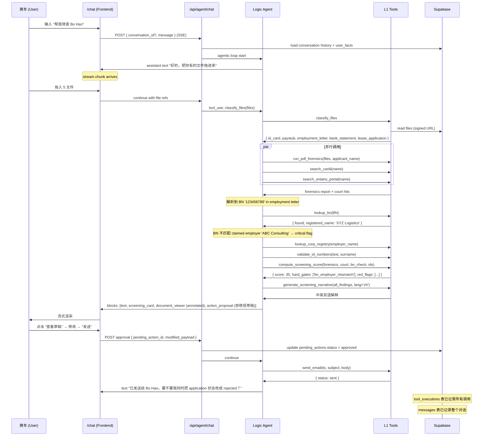

# Flow: 房东端到端 Screening

> Logic agent 主导。从房东上传文件到拿到完整 screening 报告 + 决策建议的完整对话流程。

## 触发

- 用户在 `/chat` 输入 "帮我筛查 X" / "我有个新租客的材料" 等意图
- 用户从 `/dashboard` 点击 "新建筛查" → 引导到 `/chat` 带上初始 message
- 经典模式 `/screen` 用户上传完文件 → 后端可选转 chat 流程

## Sequence Diagram

## 关键设计点

### 1. 流式分阶段
不等所有工具跑完才显示。每个工具结果到达就 stream 一段中间消息：
- "已经在解析 ID... ✓ Ontario DL 首字母对得上"
- "查 BN 中..."
- "完成。建议拒绝，原因如下..."

### 2. 并行工具调用
forensics / CanLII / Ontario Portal 三者无依赖，**Sonnet 应该一次 tool_use 包含 3 个**，agentic loop 并行执行。

### 3. 引用必须 cite
`screening_card` block 里每个 critical claim 都带 `cited_tool_executions: ['exec_abc123']`。前端 hover / click 能看到具体 tool input/output。

### 4. Action Proposal 不直接执行
拒绝信、修改 application 状态等 mutation 操作 → `pending_actions` 表 → UI 显示草稿 → 房东批准 / 修改 / 取消 → 才真正执行。

### 5. 失败优雅降级
- portal API 超时 → flag 为 "courts unavailable, retry"，不阻塞整体
- BN 工具找不到对应公司 → low-severity flag，不影响 final score
- forensics 单文件失败 → 该文件标 `forensics_error`，其他文件继续

## 与经典模式 `/screen` 的关系

`/screen` 是 form-driven 经典 UI，仍然走 `/api/screen-score` route。Sprint 1-3 期间：
- `/api/screen-score` 内部改成调用同样的 L1 工具
- 但跳过 Logic agent 对话层，直接把工具结果丢给经典 UI 渲染
- 一份工具实现，两套 UI 共用

Sprint 12+ 后视情况决定是否 redirect `/screen → /chat`。

## 性能目标

- TTFB（首 token）< 2s
- 完整 screening（5-10 文件）< 30s
- 单次成本 < $0.10（Haiku 主跑 OCR + 分类、Sonnet 主跑 reasoning）
- 并发：单 user 最多 1 个 active conversation；账户级 5 个 / 分钟

## 测试场景

- ✅ 全部正常 → score > 80
- ✅ Numbered company employer → arm_length flag
- ✅ BN mismatch → critical
- ✅ 假 SIN → identity_mismatch hard gate
- ✅ LTB record found → court_record_defendant gate
- ✅ 文件 OCR 失败 → graceful degradation
- ✅ 工具超时 → user 看到友好错误，可重试
- ✅ Conversation 中途 component unmount → AbortController cleanup
